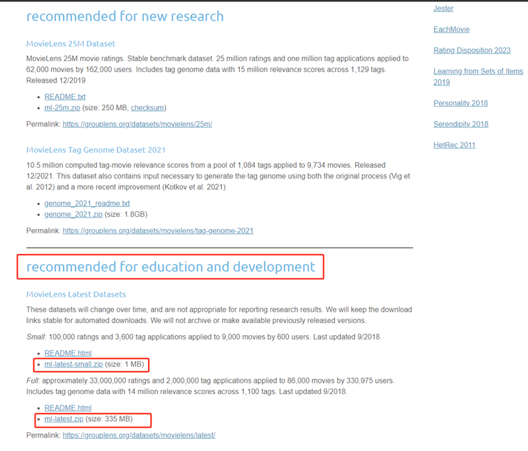

# 信息检索项目

## 题目

题目：基于矩阵分解算法的评分预测实现

主要任务：
1.	查阅相关资料，了解矩阵分解算法的基本概念、应用场景及其难点。重点了解SVD（Singular Value Decomposition，奇异值分解）系列方法。
2.	掌握Python语言的基本使用。
3.	了解梯度下降算法概念，熟悉并复现矩阵分解算法。
4.	在标准评测数据集MovieLens上验证矩阵分解算法。

实验环境：Windows或Linux, Python 3及以上

## 数据集

MovieLen数据集包含多个用户对多部电影的评分数据，也包括电影元数据信息和用户属性信息。这个数据集经常用来做推荐系统，机器学习算法的测试数据集。本次作业主要利用MovieLens Latest Datasets (ml-latest.zip)解压后的ratings.csv和movies.csv文件，其中包含用户ID、电影ID、评分、电影名称、电影类型。若硬件条件不足，也可以使用ml-latest-small.zip数据集。
数据集下载地址为：https://grouplens.org/datasets/movielens/。

